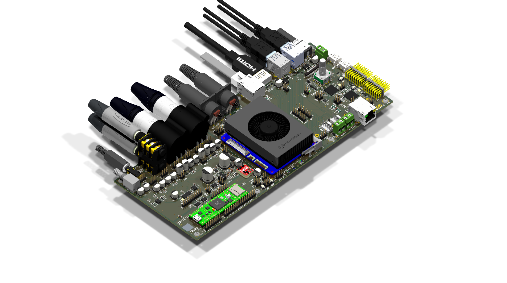

# Pandore



**Open-source digital audio instrument prototyping platform.**

Pandore is a custom-designed PCB built around the [LattePanda Mu](https://www.lattepanda.com/lattepanda-mu) compute module, a [Teensy 4.1](https://www.pjrc.com/store/teensy41.html) audio bridge, dual [RP2350](https://www.raspberrypi.com/products/rp2350/) microcontrollers, and a professional audio I/O chain. It provides a complete hardware foundation for building digital audio instruments, effects processors, and experimental sound tools.

## Status

**Revision A0** — Design complete. Manufacturing files released 2026-03-19. DRC passing, all components sourced.

## Board Specifications

| Parameter | Value |
|---|---|
| **Dimensions** | 260 mm x 110 mm |
| **Layers** | 4 (F.Cu / In1 / In2 / B.Cu) |
| **Components** | 804 (141 unique part numbers) |
| **Vias** | 2,217 |
| **Design tool** | KiCad 10 |

## Architecture

```
                         +-----------------+
                         |  LattePanda Mu  |
                         |  (x86-64 SBC)   |
                         +--------+--------+
                                  |
          +----------+-----------+-----------+----------+
          |          |                       |          |
 +--------+-------+  |             +---------+--------+ |
 |  RTIO MCU      |  |             |  Management MCU  | |
 |  (RP2350)      |  |             |  (RP2350)        | |
 +--------+-------+  |             +---------+--------+ |
          |          |                       |          |
 +--------+-------+  |             +---------+--------+ |
 | UART, SPI, I2C |  |             | GPIO, Power Seq, | |
 | ADC, 8x PWM    |  |             | Fan, Display     | |
 +----------------+  |             +------------------+ |
                     |                                  |
            +--------+--------+                         |
            |   Teensy 4.1    |                         |
            | (I2S-to-USB     |                         |
            |  Audio Bridge)  |                         |
            +--------+--------+                         |
                     |                                  |
            +--------+--------+               +---------+--------+
            |   CS4272 Codec  |               |   Boot, BIOS,    |
            |   (24-bit I2S)  |               |   Ethernet, M.2  |
            +-----------------+               +------------------+
```

### Compute

- **LattePanda Mu** — x86-64 quad-core SBC, main application processor
- **RTIO MCU (RP2350)** — Real-time I/O: UART, SPI, I2C, USB, ADC, 8x PWM channels
- **Management MCU (RP2350)** — System control: power sequencing, GPIO, fan, display, boot

### Audio

- **Audio/MIDI bridge:** [Teensy 4.1](https://www.pjrc.com/store/teensy41.html) — I2S-to-USB audio bridge between the CS4272 codec and the LattePanda Mu, also handles MIDI data transfer to the host computer
- **Codec:** Cirrus Logic CS4272 — stereo 24-bit ADC/DAC, I2S interface
- **Preamp:** THS4521 fully-differential amplifier + OPA1656 op-amp signal conditioning
- **Phantom power:** 48V ultra-low-noise step-up converter (~10 mA) for condenser microphones
- **I2S isolation:** Galvanic isolation between digital and audio domains (H11L1 optocouplers)
- **Monitor output:** Dedicated headphone/speaker amplifier with hardware volume knob
- **Input buffering:** Balanced input stage with line/mic switching
- **Output buffering:** Line-level outputs

### Power

| Rail | Voltage | Current | Purpose |
|---|---|---|---|
| Main | 5V | 2A (10W) | Digital logic, peripherals |
| Logic | 3.3V | 3A (10W) | MCUs, codec, I/O |
| Phantom | 48V | 10 mA | Condenser microphone bias |

- Reverse-polarity, overcurrent, and overvoltage protection
- Per-rail load switching (1A each on 5V)
- Managed power-on sequencing via Management MCU

### Connectivity

- **Ethernet** — RJ45 with isolation transformers
- **USB** — Host/device (FTDI bridge for legacy support)
- **MIDI** — 5-pin DIN IN/OUT
- **Display** — Flat-flex LCD connector
- **M.2** — Expansion slot (storage or optional modules)
- **Expansion headers** — GPIO, analog, I/O breakouts

### Sensors

- **BMI270** — 6-axis IMU (accelerometer + gyroscope) for motion-based control

### Thermal

- PWM-controlled fan driver circuit
- Three heatsink options: active cooler, thin passive, fanless

## Repository Structure

```
pandore/
  hw/               Schematics (.kicad_sch) and PCB layout (.kicad_pcb)
  doc/
    arch/           Architecture diagrams (draw.io)
    img/            Board renders
    reference/      Datasheets, app notes, design guides (PDF)
  lib/              3D models (.step), KiCad symbols and footprints
  release/          Manufacturing artifacts (Gerbers, BOM, placement, 3D)
```

### Schematic Hierarchy

The top-level schematic (`pandore.kicad_sch`) references 24 sub-sheets organized by subsystem:

**Audio** — `audio`, `audio-codec`, `audio-inputs`, `audio-inbuf`, `audio-outputs`, `audio-outbuf`, `audio-isolation`, `audio-monitor`, `audio-power`

**Compute** — `computer`, `cpumod`, `mcu`, `mgmtmcu`, `rtmcu`

**Power** — `power`, `audio-power`

**Interface** — `eth`, `usbport`, `midi`, `display`, `extraport`, `mdot2`

**System** — `bootctl`, `bios`, `fan`

## Manufacturing

The `release/` directory contains two packages dated 2026-03-19 (revision A0):

- **`pandore_*_A0_pcba.zip`** — PCBA package: Gerbers, drill files, BOM (.csv), pick-and-place (.pos)
- **`pandore_*_A0_release.zip`** — Full release: PCBA files + 3D assembly model (.step), assembly drawings (PDF), rendered board images, ERC/DRC reports

4-layer stackup. 2,439 drill holes. All components have manufacturer part numbers assigned.

## Reference Documentation

The `doc/reference/` directory includes datasheets and design guides used during development:

- RP2350 datasheet and hardware design guide
- LattePanda Mu evaluation kit guide and carrier board reference
- CS4272 codec (via SuperAudioBoard design guide and schematic)
- THAT1512 microphone preamp gain configuration (reference design)
- 48V phantom power supply design (TI SBOA320A + ultra-low-noise RAQ approach)
- Analog circuit design references (Analog Secrets series, AES mic preamp paper)
- THAT Corporation mic preamp reference design (git submodule)

## Requirements

- [KiCad 10](https://www.kicad.org/) to open and edit schematics and PCB layout
- [draw.io](https://app.diagrams.net/) to view architecture diagrams

## Credits

Designed by **Vincent Fillion** at [Artificiel](https://artificiel.org), with the help of **Alexandre Burton**.

Hardware engineering and KiCad source files by **Laurence Deschênes Villeneuve** ([@laurencedv](https://github.com/laurencedv)).

## License

This project is licensed under the [CERN Open Hardware Licence Version 2 — Strongly Reciprocal (CERN-OHL-S-2.0)](https://ohwr.org/cern_ohl_s_v2.txt).

You are free to use, study, modify, and distribute this design, provided that:
- You credit the original authors
- You distribute any modified versions under the same licence
- You make the source files available
